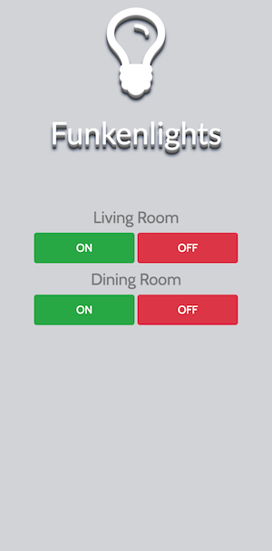

## :construction: Funkenlights :construction:

Funkenlights is a tiny Pi (and Py) powered light switch.

Note: everything is currently in :construction: don't expect it to work out of the box.

### Requirements

  - a Raspberry PI (any model should)
  - a recent version of Python (I use 3.6 but others should work too)
  - some jumper cables (or a soldering kit)
  - 433 MHz transmitter (receiver is optional)

#### Physical Setup

The interfacing with the actual hardware (that is the transmitter/receiver)is done by [433 Utils](https://github.com/ninjablocks/433Utils) and [wiringpi](https://projects.drogon.net/raspberry-pi/wiringpi/download-and-install/). Make sure to get those installed/compiled/run and the follow the instructions below.

There's plenty of tutorials for this out there like [this](https://www.princetronics.com/how-to-read-433-mhz-codes-w-raspberry-pi-433-mhz-receiver/)


#### Installation

Clone the repo, install the requirements using and run the app. It is recommended to do this in a virtual environment.
```sh
# clone repo
git clone git@github.com:stefanSchinkel/funkenlights.git
cd funkenlights

# create  a virtual environment
python -m venv .venv
# for python version prior to 3.5  use all call like this
# -p provides the path to the Python interpreter you want to use
# virtualenv -p /usr/bin/python3.4 .venv

# activate virtualenv
source .venv/bin/activate

# install requirements
pip install -r requirements.txt

# edit and rename the config file
mv config.sample.json config.json
vim config.json         # insert the path to the binaries and the codes to use

# run app
python main.py
```

This will expose the interface at `http://IP_OF_RASPBERRY:5000` and `http://HOSTNAME_OF_RASPBERRY:5000` as the webapp binds to *all* interfaces available.

This has security problems. Anybody in with network access to you Raspberry can use it. That's usually desired for private households, because everybody wants to switch on/off the lights, but might not be a smart idea in open networks.

#### Configuration

All switches are configured in config.json (a sample is in the repo). Same goes for the binaries.

#### Usage

Fairly simple. Open the exposed adress with any webbrowser/mobile/tablet and switch your lights.



